# Amazon Web Services + WordPress CodeDeploy configuration

<h2 class="c0 c9">Set up IAM user for Github</h2><ol class="c2 lst-kix_qzs1w58ull57-0 start" start="1"><li class="c0 c10">On the <a class="c4" href="https://www.google.com/url?q=https://console.aws.amazon.com/iam&amp;sa=D&amp;usg=AFQjCNGEi_A0lYwQKTtnkaMijAQ0K6-0Fw">IAM main page</a>, click &ldquo;Users&rdquo; on the left menu.</li><li class="c0 c10">Click &ldquo;Create New Users&rdquo;.</li><li class="c0 c10">Enter &ldquo;github&rdquo; into the first box and click &ldquo;Create&rdquo;..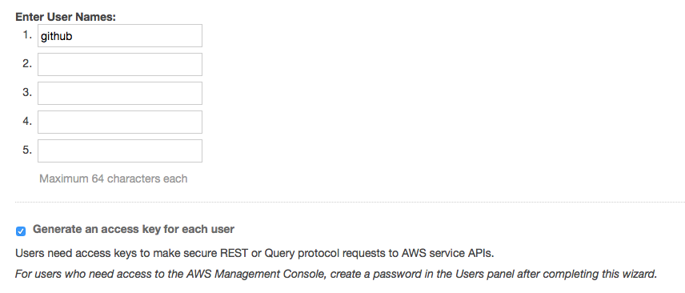</li><li class="c0 c10">Click &ldquo;Show User Security Credentials&rdquo; and note the values for both &ldquo;Access Key ID&rdquo; and &ldquo;Secret Access Key&rdquo;. We will use these values below under the &ldquo;Calling AWS CodeDeploy from GitHub&rdquo; section. 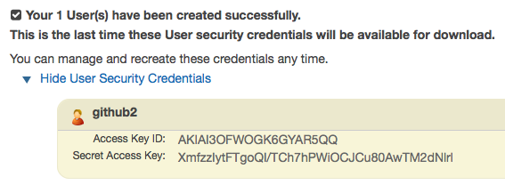</li><li class="c0 c10">Click &ldquo;Close,&rdquo; as we do not need to download the credentials. Confirm by clicking &ldquo;Close&rdquo; again.  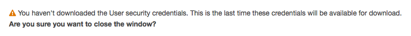</li><li class="c0 c10">Back at the user listing screen, click the newly created &ldquo;github&rdquo; user.</li><li class="c0 c10">Under &ldquo;Permissions&rdquo;, click the arrow next to &ldquo;Inline Policies&rdquo; to reveal the link to create an inline policy. Click the &ldquo;click here&rdquo; link. 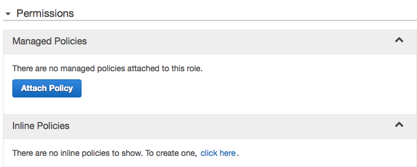</li><li class="c0 c10">On the &ldquo;Set Permissions&rdquo; screen, select the radio button next to &ldquo;Custom Policy&rdquo; and click the &ldquo;Select&rdquo; button. 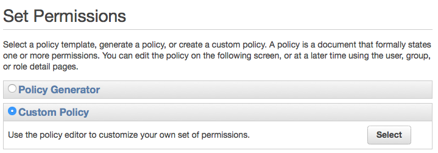</li><li class="c0 c10">Review Policy</li></ol><ol class="c2 lst-kix_qzs1w58ull57-1 start" start="1"><li class="c0 c7">Policy Name: CodeDeploy-Access</li><li class="c0 c7">Policy Document:</li></ol><table cellpadding="0" cellspacing="0" class="c15"><tbody><tr class="c13"><td class="c23" colspan="1" rowspan="1">
{  &nbsp;&quot;Version&quot;:&nbsp;&quot;2012-10-17&quot;,  &nbsp;&quot;Statement&quot;:&nbsp;[  &nbsp; &nbsp;{  &nbsp; &nbsp; &nbsp;&quot;Effect&quot;:&nbsp;&quot;Allow&quot;,  &nbsp; &nbsp; &nbsp;&quot;Action&quot;:&nbsp;&quot;codedeploy:*&quot;,  &nbsp; &nbsp; &nbsp;&quot;Resource&quot;:&nbsp;&quot;*&quot;  &nbsp; &nbsp;}  &nbsp;] }
</td></tr></tbody></table><ol class="c2 lst-kix_qzs1w58ull57-1" start="3"><li class="c0 c7">Click &ldquo;Accept Policy&rdquo;.</li></ol>

<h2 class="c0 c9">Set up IAM role for EC2 instances</h2><ol class="c2 lst-kix_ny18wmoqeabm-0 start" start="1"><li class="c0 c10">On the <a class="c4" href="https://www.google.com/url?q=https://console.aws.amazon.com/iam&amp;sa=D&amp;usg=AFQjCNGEi_A0lYwQKTtnkaMijAQ0K6-0Fw">IAM main page</a>, click &ldquo;Roles&rdquo; on the left menu.</li><li class="c0 c10">Click &ldquo;Create New Role&rdquo; 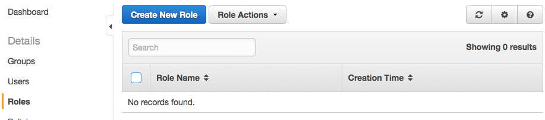</li></ol><ol class="c2 lst-kix_ny18wmoqeabm-1 start" start="1"><li class="c0 c7">Step 1: Set Role Name</li></ol><ol class="c2 lst-kix_ny18wmoqeabm-2 start" start="1"><li class="c0 c17">Role Name: CodeDeployEC2</li></ol><ol class="c2 lst-kix_ny18wmoqeabm-1" start="2"><li class="c0 c7">Step 2: Select Role Type</li></ol><ol class="c2 lst-kix_ny18wmoqeabm-2 start" start="1"><li class="c0 c17">Click &ldquo;Select&rdquo; next to &ldquo;Amazon EC2 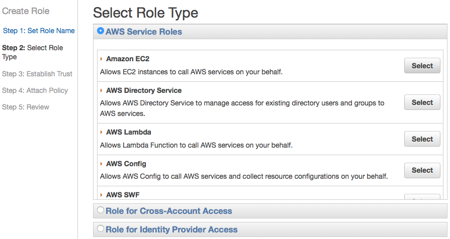</li></ol><ol class="c2 lst-kix_ny18wmoqeabm-1" start="3"><li class="c0 c7">Step 3: Establish Trust (gets skipped automatically)</li><li class="c0 c7">Step 4: Attach Policy</li></ol><ol class="c2 lst-kix_ny18wmoqeabm-2 start" start="1"><li class="c0 c17">Click &ldquo;Next Step&rdquo; without selecting a policy.</li></ol><ol class="c2 lst-kix_ny18wmoqeabm-1" start="5"><li class="c0 c7">Step 5: Review</li></ol><ol class="c2 lst-kix_ny18wmoqeabm-2 start" start="1"><li class="c0 c17">Click &ldquo;Create Role&rdquo;. 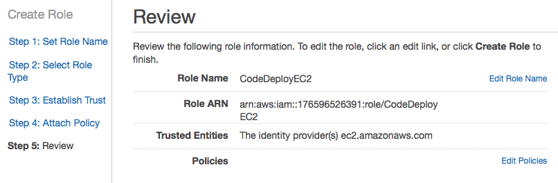</li></ol><ol class="c2 lst-kix_ny18wmoqeabm-1" start="6"><li class="c0 c7">Click the newly created policy on the listing screen. 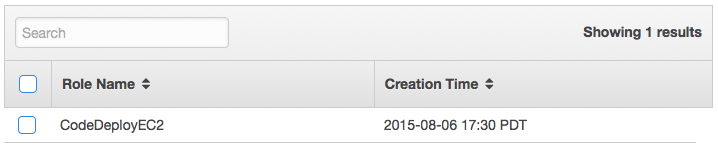</li><li class="c0 c7">Under &ldquo;Permissions&rdquo;, click the arrow next to &ldquo;Inline Policies&rdquo; to reveal the link to create an inline policy. Click the &ldquo;click here&rdquo; link. </li><li class="c0 c7">On the &ldquo;Set Permissions&rdquo; screen, select the radio button next to &ldquo;Custom Policy&rdquo; and click the &ldquo;Select&rdquo; button. </li><li class="c0 c7">Review Policy</li></ol><ol class="c2 lst-kix_ny18wmoqeabm-2 start" start="1"><li class="c0 c17">Policy Name: InstanceRole</li><li class="c0 c17">Policy Document:</li></ol><table cellpadding="0" cellspacing="0" class="c15"><tbody><tr class="c13"><td class="c23" colspan="1" rowspan="1">
{

&nbsp;&nbsp;&nbsp;&nbsp;&nbsp;&nbsp;&nbsp;&nbsp;&quot;Statement&quot;:&nbsp;[

&nbsp; &nbsp; &nbsp;&nbsp;&nbsp;&nbsp;&nbsp;&nbsp;&nbsp;&nbsp;{

&nbsp; &nbsp; &nbsp; &nbsp; &nbsp;&nbsp;&nbsp;&nbsp;&nbsp;&nbsp;&nbsp;&nbsp;&quot;Resource&quot;:&nbsp;&quot;*&quot;,

&nbsp; &nbsp; &nbsp; &nbsp; &nbsp;&nbsp;&nbsp;&nbsp;&nbsp;&nbsp;&nbsp;&nbsp;&quot;Action&quot;:&nbsp;[

&nbsp; &nbsp; &nbsp; &nbsp; &nbsp; &nbsp; &nbsp;&nbsp;&nbsp;&nbsp;&nbsp;&nbsp;&nbsp;&nbsp;&quot;autoscaling:Describe*&quot;,

&nbsp; &nbsp; &nbsp; &nbsp; &nbsp; &nbsp; &nbsp;&nbsp;&nbsp;&nbsp;&nbsp;&nbsp;&nbsp;&nbsp;&quot;cloudformation:Describe*&quot;,

&nbsp; &nbsp; &nbsp; &nbsp; &nbsp; &nbsp; &nbsp;&nbsp;&nbsp;&nbsp;&nbsp;&nbsp;&nbsp;&nbsp;&quot;cloudformation:GetTemplate&quot;,

&nbsp; &nbsp; &nbsp; &nbsp; &nbsp; &nbsp; &nbsp;&nbsp;&nbsp;&nbsp;&nbsp;&nbsp;&nbsp;&nbsp;&quot;s3:Get*&quot;

&nbsp; &nbsp; &nbsp; &nbsp; &nbsp;&nbsp;&nbsp;&nbsp;&nbsp;&nbsp;&nbsp;&nbsp;],

&nbsp; &nbsp; &nbsp; &nbsp; &nbsp;&nbsp;&nbsp;&nbsp;&nbsp;&nbsp;&nbsp;&nbsp;&quot;Effect&quot;:&nbsp;&quot;Allow&quot;

&nbsp; &nbsp; &nbsp;&nbsp;&nbsp;&nbsp;&nbsp;&nbsp;&nbsp;&nbsp;}

&nbsp;&nbsp;&nbsp;&nbsp;&nbsp;&nbsp;&nbsp;&nbsp;]

}
</td></tr></tbody></table><ol class="c2 lst-kix_ny18wmoqeabm-2" start="3"><li class="c0 c17">Click &ldquo;Accept Policy&rdquo;.</li></ol><ol class="c2 lst-kix_ny18wmoqeabm-1" start="10"><li class="c0 c7">Under &ldquo;Trust Relationships&rdquo;, &ldquo;The identity provider(s) ec2.amazonaws.com&rdquo; should already be listed under &ldquo;Trusted Entities&rdquo;. 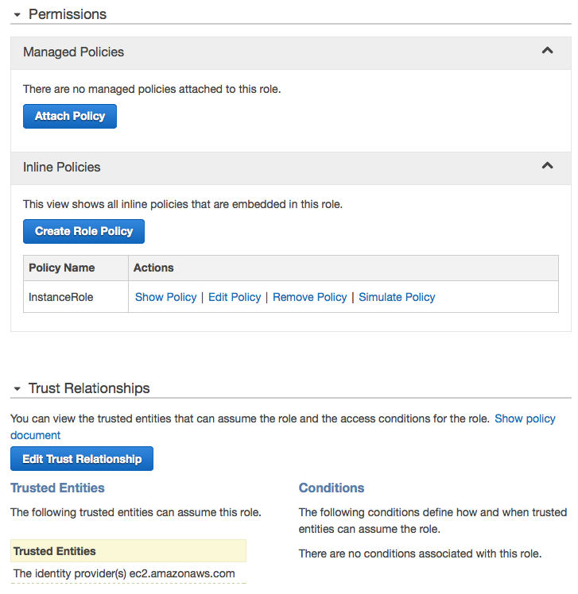</li></ol>

<h2 class="c0 c9">Set up IAM role for CodeDeploy</h2><ol class="c2 lst-kix_ny18wmoqeabm-0" start="3"><li class="c0 c10">On the <a class="c4" href="https://www.google.com/url?q=https://console.aws.amazon.com/iam&amp;sa=D&amp;usg=AFQjCNGEi_A0lYwQKTtnkaMijAQ0K6-0Fw">IAM main page</a>, click &ldquo;Roles&rdquo; on the left menu.</li><li class="c0 c10">Click &ldquo;Create New Role&rdquo;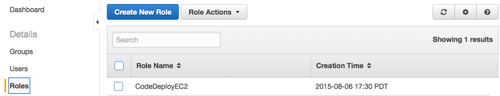 </li></ol><ol class="c2 lst-kix_ny18wmoqeabm-1 start" start="1"><li class="c0 c7">Step 1: Set Role Name</li></ol><ol class="c2 lst-kix_ny18wmoqeabm-2 start" start="1"><li class="c0 c17">Role Name: CodeDeployWordPress</li></ol><ol class="c2 lst-kix_ny18wmoqeabm-1" start="2"><li class="c0 c7">Step 2: Select Role Type</li></ol><ol class="c2 lst-kix_ny18wmoqeabm-2 start" start="1"><li class="c0 c17">Click &ldquo;Select&rdquo; next to &ldquo;Amazon EC2 </li></ol><ol class="c2 lst-kix_ny18wmoqeabm-1" start="3"><li class="c0 c7">Step 3: Establish Trust (gets skipped automatically)</li><li class="c0 c7">Step 4: Attach Policy</li></ol><ol class="c2 lst-kix_ny18wmoqeabm-2 start" start="1"><li class="c0 c17">Click &ldquo;Next Step&rdquo; without selecting a policy.</li></ol><ol class="c2 lst-kix_ny18wmoqeabm-1" start="5"><li class="c0 c7">Step 5: Review</li></ol><ol class="c2 lst-kix_ny18wmoqeabm-2 start" start="1"><li class="c0 c17">Click &ldquo;Create Role&rdquo;. 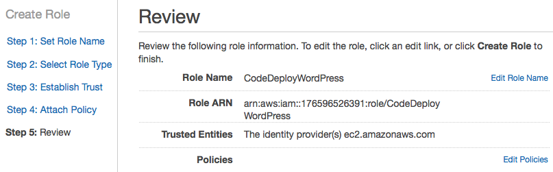</li></ol><ol class="c2 lst-kix_ny18wmoqeabm-1" start="6"><li class="c0 c7">Click the newly created policy on the listing screen. 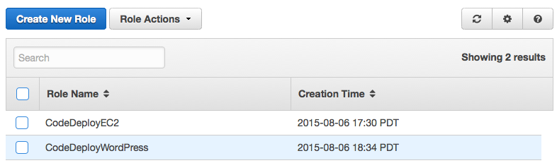</li><li class="c0 c7">Under &ldquo;Permissions&rdquo;, click the arrow next to &ldquo;Inline Policies&rdquo; to reveal the link to create an inline policy. Click the &ldquo;click here&rdquo; link. </li><li class="c0 c7">On the &ldquo;Set Permissions&rdquo; screen, select the radio button next to &ldquo;Custom Policy&rdquo; and click the &ldquo;Select&rdquo; button. </li><li class="c0 c7">Review Policy</li></ol><ol class="c2 lst-kix_ny18wmoqeabm-2 start" start="1"><li class="c0 c17">Policy Name: CodeDeployPolicy</li><li class="c0 c17">Policy Document:</li></ol><table cellpadding="0" cellspacing="0" class="c15"><tbody><tr class="c13"><td class="c23" colspan="1" rowspan="1">
{

&nbsp;&nbsp;&nbsp;&nbsp;&nbsp;&nbsp;&nbsp;&nbsp;&quot;Version&quot;:&nbsp;&quot;2008-10-17&quot;,

&nbsp;&nbsp;&nbsp;&nbsp;&nbsp;&nbsp;&nbsp;&nbsp;&quot;Statement&quot;:&nbsp;[

&nbsp; &nbsp;&nbsp;&nbsp;&nbsp;&nbsp;&nbsp;&nbsp;&nbsp;&nbsp;{

&nbsp; &nbsp; &nbsp; &nbsp;&nbsp;&nbsp;&nbsp;&nbsp;&nbsp;&nbsp;&nbsp;&nbsp;&quot;Effect&quot;:&nbsp;&quot;Allow&quot;,

&nbsp; &nbsp; &nbsp; &nbsp;&nbsp;&nbsp;&nbsp;&nbsp;&nbsp;&nbsp;&nbsp;&nbsp;&quot;Resource&quot;:&nbsp;[

&nbsp; &nbsp; &nbsp; &nbsp; &nbsp; &nbsp;&nbsp;&nbsp;&nbsp;&nbsp;&nbsp;&nbsp;&nbsp;&nbsp;&quot;*&quot;

&nbsp; &nbsp; &nbsp; &nbsp;&nbsp;&nbsp;&nbsp;&nbsp;&nbsp;&nbsp;&nbsp;&nbsp;],

&nbsp; &nbsp; &nbsp; &nbsp;&nbsp;&nbsp;&nbsp;&nbsp;&nbsp;&nbsp;&nbsp;&nbsp;&quot;Action&quot;:&nbsp;[

&nbsp; &nbsp; &nbsp; &nbsp; &nbsp; &nbsp;&nbsp;&nbsp;&nbsp;&nbsp;&nbsp;&nbsp;&nbsp;&nbsp;&quot;ec2:Describe*&quot;

&nbsp; &nbsp; &nbsp; &nbsp;&nbsp;&nbsp;&nbsp;&nbsp;&nbsp;&nbsp;&nbsp;&nbsp;]

&nbsp; &nbsp;&nbsp;&nbsp;&nbsp;&nbsp;&nbsp;&nbsp;&nbsp;&nbsp;},

&nbsp; &nbsp;&nbsp;&nbsp;&nbsp;&nbsp;&nbsp;&nbsp;&nbsp;&nbsp;{

&nbsp; &nbsp; &nbsp; &nbsp;&nbsp;&nbsp;&nbsp;&nbsp;&nbsp;&nbsp;&nbsp;&nbsp;&quot;Effect&quot;:&nbsp;&quot;Allow&quot;,

&nbsp; &nbsp; &nbsp; &nbsp;&nbsp;&nbsp;&nbsp;&nbsp;&nbsp;&nbsp;&nbsp;&nbsp;&quot;Resource&quot;:&nbsp;[

&nbsp; &nbsp; &nbsp; &nbsp; &nbsp; &nbsp;&nbsp;&nbsp;&nbsp;&nbsp;&nbsp;&nbsp;&nbsp;&nbsp;&quot;*&quot;

&nbsp; &nbsp; &nbsp; &nbsp;&nbsp;&nbsp;&nbsp;&nbsp;&nbsp;&nbsp;&nbsp;&nbsp;],

&nbsp; &nbsp; &nbsp; &nbsp;&nbsp;&nbsp;&nbsp;&nbsp;&nbsp;&nbsp;&nbsp;&nbsp;&quot;Action&quot;:&nbsp;[

&nbsp; &nbsp; &nbsp; &nbsp; &nbsp; &nbsp;&nbsp;&nbsp;&nbsp;&nbsp;&nbsp;&nbsp;&nbsp;&nbsp;&quot;autoscaling:CompleteLifecycleAction&quot;,

&nbsp; &nbsp; &nbsp; &nbsp; &nbsp; &nbsp;&nbsp;&nbsp;&nbsp;&nbsp;&nbsp;&nbsp;&nbsp;&nbsp;&quot;autoscaling:DeleteLifecycleHook&quot;,

&nbsp; &nbsp; &nbsp; &nbsp; &nbsp; &nbsp;&nbsp;&nbsp;&nbsp;&nbsp;&nbsp;&nbsp;&nbsp;&nbsp;&quot;autoscaling:DescribeLifecycleHooks&quot;,

&nbsp; &nbsp; &nbsp; &nbsp; &nbsp; &nbsp;&nbsp;&nbsp;&nbsp;&nbsp;&nbsp;&nbsp;&nbsp;&nbsp;&quot;autoscaling:DescribeAutoScalingGroups&quot;,

&nbsp; &nbsp; &nbsp; &nbsp; &nbsp; &nbsp;&nbsp;&nbsp;&nbsp;&nbsp;&nbsp;&nbsp;&nbsp;&nbsp;&quot;autoscaling:PutLifecycleHook&quot;,

&nbsp; &nbsp; &nbsp; &nbsp; &nbsp; &nbsp;&nbsp;&nbsp;&nbsp;&nbsp;&nbsp;&nbsp;&nbsp;&nbsp;&quot;autoscaling:RecordLifecycleActionHeartbeat&quot;

&nbsp; &nbsp; &nbsp; &nbsp;&nbsp;&nbsp;&nbsp;&nbsp;&nbsp;&nbsp;&nbsp;&nbsp;]

&nbsp; &nbsp;&nbsp;&nbsp;&nbsp;&nbsp;&nbsp;&nbsp;&nbsp;&nbsp;},

&nbsp; &nbsp;&nbsp;&nbsp;&nbsp;&nbsp;&nbsp;&nbsp;&nbsp;&nbsp;{

&nbsp; &nbsp; &nbsp; &nbsp;&nbsp;&nbsp;&nbsp;&nbsp;&nbsp;&nbsp;&nbsp;&nbsp;&quot;Effect&quot;:&nbsp;&quot;Allow&quot;,

&nbsp; &nbsp; &nbsp; &nbsp;&nbsp;&nbsp;&nbsp;&nbsp;&nbsp;&nbsp;&nbsp;&nbsp;&quot;Resource&quot;:&nbsp;[

&nbsp; &nbsp; &nbsp; &nbsp; &nbsp; &nbsp;&nbsp;&nbsp;&nbsp;&nbsp;&nbsp;&nbsp;&nbsp;&nbsp;&quot;*&quot;

&nbsp; &nbsp; &nbsp; &nbsp;&nbsp;&nbsp;&nbsp;&nbsp;&nbsp;&nbsp;&nbsp;&nbsp;],

&nbsp; &nbsp; &nbsp; &nbsp;&nbsp;&nbsp;&nbsp;&nbsp;&nbsp;&nbsp;&nbsp;&nbsp;&quot;Action&quot;:&nbsp;[

&nbsp; &nbsp; &nbsp; &nbsp; &nbsp; &nbsp;&nbsp;&nbsp;&nbsp;&nbsp;&nbsp;&nbsp;&nbsp;&nbsp;&quot;Tag:getResources&quot;,

&nbsp; &nbsp; &nbsp; &nbsp; &nbsp; &nbsp;&nbsp;&nbsp;&nbsp;&nbsp;&nbsp;&nbsp;&nbsp;&nbsp;&quot;Tag:getTags&quot;,

&nbsp; &nbsp; &nbsp; &nbsp; &nbsp; &nbsp;&nbsp;&nbsp;&nbsp;&nbsp;&nbsp;&nbsp;&nbsp;&nbsp;&quot;Tag:getTagsForResource&quot;,

&nbsp; &nbsp; &nbsp; &nbsp; &nbsp; &nbsp;&nbsp;&nbsp;&nbsp;&nbsp;&nbsp;&nbsp;&nbsp;&nbsp;&quot;Tag:getTagsForResourceList&quot;

&nbsp; &nbsp; &nbsp; &nbsp;&nbsp;&nbsp;&nbsp;&nbsp;&nbsp;&nbsp;&nbsp;&nbsp;]

&nbsp; &nbsp;&nbsp;&nbsp;&nbsp;&nbsp;&nbsp;&nbsp;&nbsp;&nbsp;}

&nbsp;&nbsp;&nbsp;&nbsp;&nbsp;&nbsp;&nbsp;&nbsp;]

}
</td></tr></tbody></table><ol class="c2 lst-kix_ny18wmoqeabm-2" start="3"><li class="c0 c17">Click &ldquo;Accept Policy&rdquo;.</li></ol><ol class="c2 lst-kix_ny18wmoqeabm-1" start="10"><li class="c0 c7">Under &ldquo;Trust Relationships&rdquo;, click &ldquo;Edit Trust Relationship&rdquo;.</li></ol><ol class="c2 lst-kix_ny18wmoqeabm-2 start" start="1"><li class="c0 c17">Replace the policy document with the following: </li></ol><table cellpadding="0" cellspacing="0" class="c15"><tbody><tr class="c13"><td class="c23" colspan="1" rowspan="1">
{

&nbsp;&quot;Version&quot;:&nbsp;&quot;2008-10-17&quot;,

&nbsp;&quot;Statement&quot;:&nbsp;[

&nbsp;&nbsp;&nbsp;&nbsp;&nbsp;&nbsp;&nbsp;&nbsp;{

&nbsp;&nbsp;&nbsp;&nbsp;&nbsp;&nbsp;&nbsp;&nbsp;&nbsp;&quot;Sid&quot;:&nbsp;&quot;1&quot;,

&nbsp;&nbsp;&nbsp;&nbsp;&nbsp;&nbsp;&nbsp;&nbsp;&nbsp;&quot;Effect&quot;:&nbsp;&quot;Allow&quot;,

&nbsp;&nbsp;&nbsp;&nbsp;&nbsp;&nbsp;&nbsp;&nbsp;&nbsp;&quot;Principal&quot;:&nbsp;{

&nbsp; &nbsp;&nbsp;&nbsp;&nbsp;&nbsp;&nbsp;&nbsp;&nbsp;&nbsp;&quot;Service&quot;:&nbsp;&quot;codedeploy.amazonaws.com&quot;

&nbsp;&nbsp;&nbsp;&nbsp;&nbsp;&nbsp;&nbsp;&nbsp;&nbsp;},

&nbsp;&nbsp;&nbsp;&nbsp;&nbsp;&nbsp;&nbsp;&nbsp;&nbsp;&quot;Action&quot;:&nbsp;&quot;sts:AssumeRole&quot;

&nbsp;&nbsp;&nbsp;&nbsp;&nbsp;&nbsp;&nbsp;&nbsp;}

&nbsp;]

}
</td></tr></tbody></table><ol class="c2 lst-kix_ny18wmoqeabm-2" start="2"><li class="c0 c17">Click &ldquo;Update Trust Policy&rdquo;.</li><li class="c0 c17">&ldquo;The identity provider(s) codedeploy.amazonaws.com&rdquo; should now be listed under &ldquo;Trusted Entities&rdquo;.</li></ol><ol class="c2 lst-kix_ny18wmoqeabm-1" start="11"><li class="c0 c7">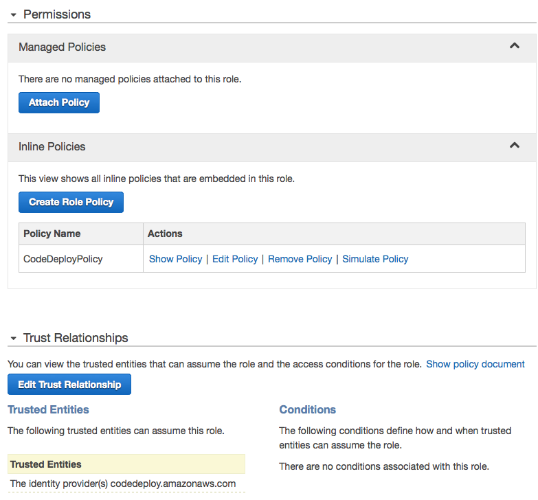</li></ol>

<h2 class="c0 c9">Set up EC2 instance</h2><ol class="c2 lst-kix_td7jmalm3pno-0 start" start="1"><li class="c0 c10">On the EC2 main page (us-west-2), click &ldquo;Instances&rdquo; on the left menu and then click &ldquo;Launch Instance&rdquo;. 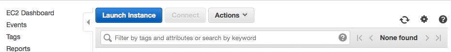</li><li class="c0 c10">Step 1: Choose an Amazon Machine Image (AMI)</li></ol><ol class="c2 lst-kix_td7jmalm3pno-1 start" start="1"><li class="c0 c7">Click &ldquo;Select&rdquo; next to &ldquo;Ubuntu Server 14.04 LTS (HVM), SSD Volume Type&rdquo;. 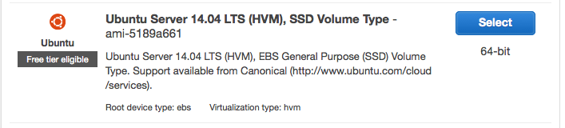</li></ol><ol class="c2 lst-kix_td7jmalm3pno-0" start="3"><li class="c0 c10">Step 2: Choose an Instance Type</li></ol><ol class="c2 lst-kix_td7jmalm3pno-1 start" start="1"><li class="c0 c7">Select m3.large and click &ldquo;Next: Configure Instance Details&rdquo;. 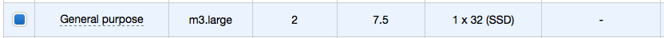</li></ol><ol class="c2 lst-kix_td7jmalm3pno-0" start="4"><li class="c0 c10">Step 3: Configure Instance Details</li></ol><ol class="c2 lst-kix_td7jmalm3pno-1 start" start="1"><li class="c0 c7">Number of Instances: 1</li><li class="c0 c7">IAM role: CodeDeployEC2 (created above)</li><li class="c0 c7">Enable termination protection: Protect against accidental termination</li><li class="c0 c7">Monitoring: Enable CloudWater detailed monitoring</li><li class="c0 c7">Click &ldquo;Next: Add Storage&rdquo;. 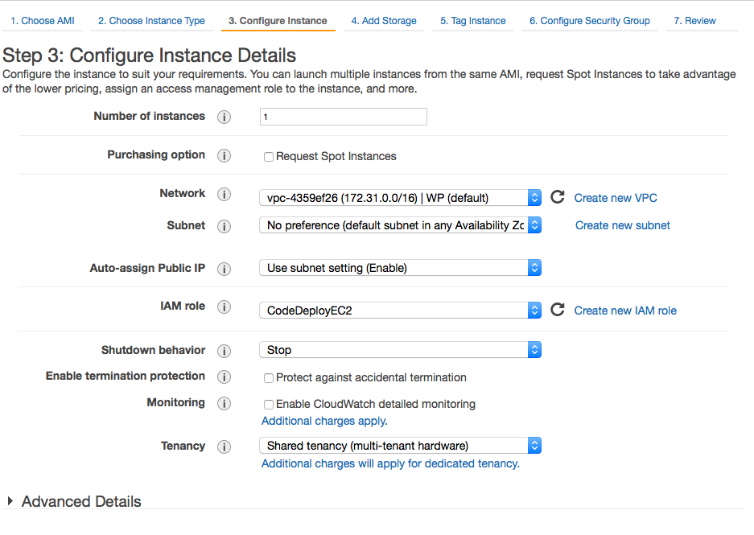</li></ol><ol class="c2 lst-kix_td7jmalm3pno-0" start="5"><li class="c0 c10">Step 4: Add Storage</li></ol><ol class="c2 lst-kix_td7jmalm3pno-1 start" start="1"><li class="c0 c7">Remove the &ldquo;Instance Store&rdquo; line item by clicking the &ldquo;X&rdquo; if applicable.</li><li class="c0 c7">Change the root volume to 80 GB.</li><li class="c0 c7">Uncheck the &ldquo;Delete on Termination&rdquo; checkbox. 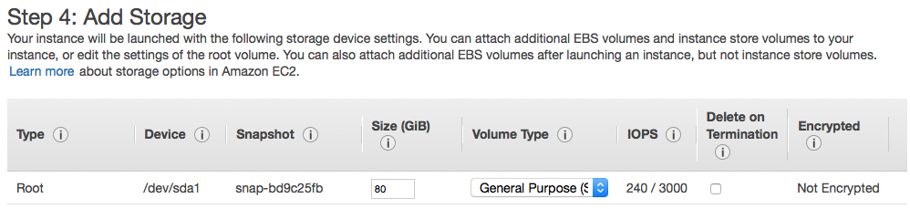</li><li class="c0 c7">Click &ldquo;Next: Tag Instance&rdquo;.</li></ol><ol class="c2 lst-kix_td7jmalm3pno-0" start="6"><li class="c0 c10">Step 5: Tag Instance</li></ol><ol class="c2 lst-kix_td7jmalm3pno-1 start" start="1"><li class="c0 c7">Ensure &ldquo;Name&rdquo; is entered in the &ldquo;Key&rdquo; box of Row 1, and enter &ldquo;WordPress&rdquo; in the &ldquo;Value&rdquo; box. 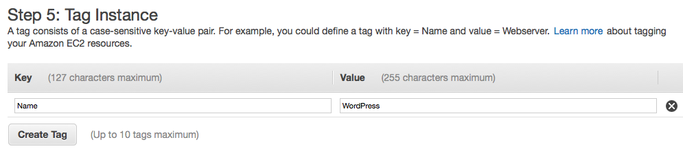</li><li class="c0 c7">Click &ldquo;Next: Configure Security Group&rdquo;.</li></ol><ol class="c2 lst-kix_td7jmalm3pno-0" start="7"><li class="c0 c10">Step 6: Configure Security Group</li></ol><ol class="c2 lst-kix_td7jmalm3pno-1 start" start="1"><li class="c0 c7">Next to &ldquo;Assign a security group&rdquo;, click the radio button next to &ldquo;Select an existing security group&rdquo;. Then check the box next to the &ldquo;WordPress&rdquo; item created previously. 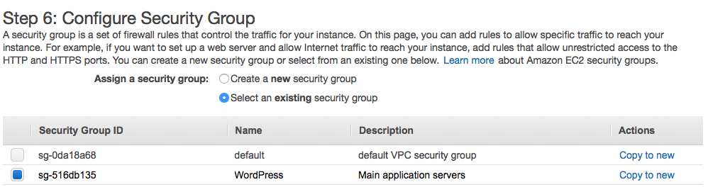</li><li class="c0 c7">Click &ldquo;Review and Launch&rdquo;.</li></ol><ol class="c2 lst-kix_td7jmalm3pno-0" start="8"><li class="c0 c10">Step 7: Review Instance Launch</li></ol><ol class="c2 lst-kix_td7jmalm3pno-1 start" start="1"><li class="c0 c7">Click &ldquo;Launch&rdquo; after confirming the settings. 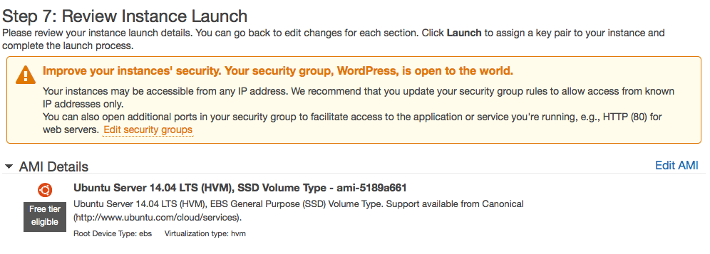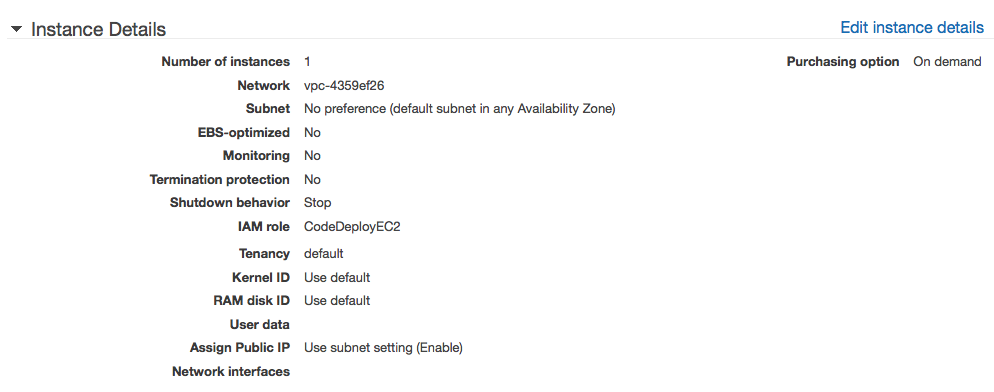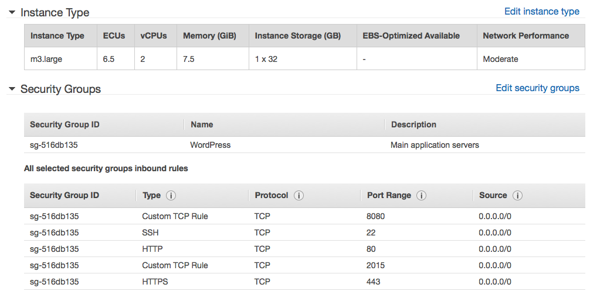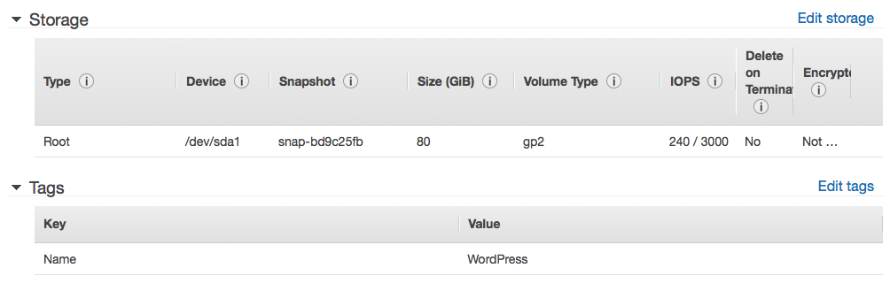</li></ol><ol class="c2 lst-kix_td7jmalm3pno-0" start="9"><li class="c0 c10">Select an existing key pair or create a new key pair</li></ol><ol class="c2 lst-kix_td7jmalm3pno-1 start" start="1"><li class="c0 c7">From the drop down, select &ldquo;Create a new key pair&rdquo;.</li><li class="c0 c7">Key pair name: WordPress</li><li class="c0 c7">Click &ldquo;Download Key Pair&rdquo;. 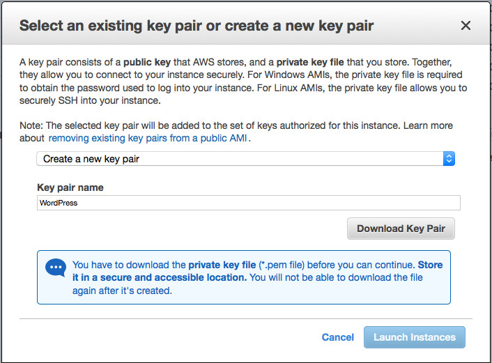</li><li class="c0 c7">Save the PEM file somewhere safe.</li><li class="c0 c7">Click &ldquo;Launch Instances&rdquo;.</li></ol><ol class="c2 lst-kix_td7jmalm3pno-0" start="10"><li class="c0 c10">Once launched, navigate to the EC2 instance listing screen and select the new instance. Note the IP address and connect to it by SSH using a command like: ssh -i ~/Downloads/WordPress.pem <a class="c4" href="mailto:ubuntu@xxx.xxx.xxx.xxx">ubuntu@xxx.xxx.xxx.xxx</a></li><li class="c0 c10">Run the following commands (or run the full command list at <a class="c4" href="https://www.google.com/url?q=https://github.com/clientname/clientname-wp/wiki/DEV-server-setup&amp;sa=D&amp;usg=AFQjCNE76BdDmlHm2o7W5oLQBRuc5iI15w">https://github.com/clientname/clientname-wp/wiki/DEV-server-setup</a>&nbsp;):</li></ol><table cellpadding="0" cellspacing="0" class="c12"><tbody><tr class="c13"><td class="c23" colspan="1" rowspan="1">
sudo apt-get&nbsp;update

sudo apt-get&nbsp;-y install awscli ruby2.0

sudo aws configure

#AWS Access Key ID [None]:

#AWS Secret Access Key [None]:

#Default region name [None]: uw-west-2

#Default output format [None]: json

cd /home/ubuntu

#If we are in Oregon

sudo aws s3 cp s3://aws-codedeploy-us-west-2/latest/install . --region us-west-2

#If we are in Virginia

#sudo aws s3 cp s3://aws-codedeploy-us-east-1/latest/install . --region us-east-1

sudo chmod +x ./install

sudo ./install auto

sudo service codedeploy-agent status

# The AWS CodeDeploy agent is running as PID 5777
</td></tr></tbody></table><ol class="c2 lst-kix_c8z1h5m2vgce-0 start" start="1"><li class="c0 c10">Add the instance to the elastic IP associated with the domain name.</li></ol><h2 class="c0 c9">Set up CodeDeploy application and deployment</h2><ol class="c2 lst-kix_7wax3zl94t0p-0 start" start="1"><li class="c0 c10">On the CodeDeploy main page (<a class="c4" href="https://www.google.com/url?q=https://us-west-2.console.aws.amazon.com/codedeploy/home?region%3Dus-west-2&amp;sa=D&amp;usg=AFQjCNGDNzzP7zCqcL3Jr3jF9eci4PG-5A">us-west-2</a>), click &ldquo;Get Started Now&rdquo; if this is the first deployment. 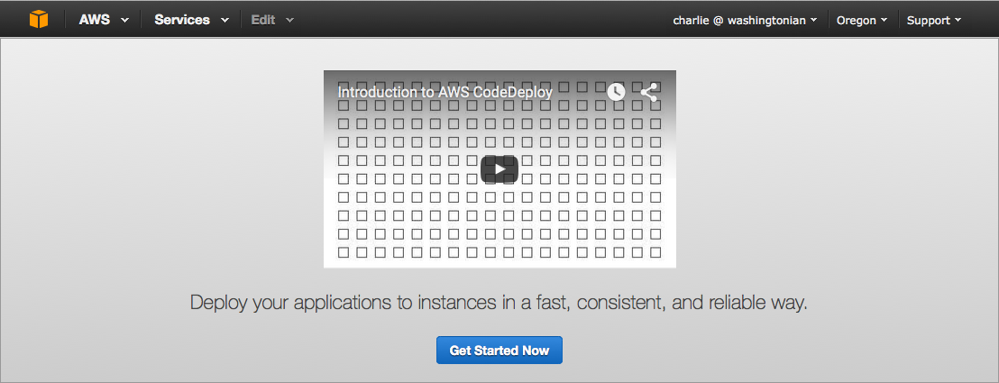 </li><li class="c0 c10">If the &ldquo;Welcome to AWS CodeDeploy&rdquo; screen appears, select &ldquo;Custom Deployment&rdquo; and then click &ldquo;Skip Walkthrough&rdquo;. 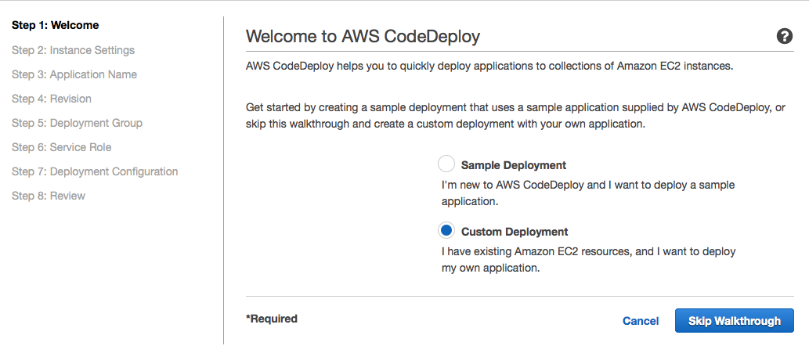 </li><li class="c0 c10">On the &ldquo;Create New Application&rdquo; screen:</li></ol><ol class="c2 lst-kix_7wax3zl94t0p-1 start" start="1"><li class="c0 c7">Application Name: wordpress</li><li class="c0 c7">Deployment Group Name: develop</li><li class="c0 c7">Add Instances</li></ol><ol class="c2 lst-kix_7wax3zl94t0p-2 start" start="1"><li class="c0 c17">Search by Tags</li></ol><ol class="c2 lst-kix_7wax3zl94t0p-3 start" start="1"><li class="c0 c25">Tag Type: Amazon EC2</li><li class="c0 c25">Key: Name</li><li class="c0 c25">Value: WordPress</li></ol><ol class="c2 lst-kix_7wax3zl94t0p-1" start="4"><li class="c0 c7">Deployment Configuration</li></ol><ol class="c2 lst-kix_7wax3zl94t0p-2 start" start="1"><li class="c0 c17">Deployment Config*: CodeDeployDefault.OneAtATime</li></ol><ol class="c2 lst-kix_7wax3zl94t0p-1" start="5"><li class="c0 c7">Service Role</li></ol><ol class="c2 lst-kix_7wax3zl94t0p-2 start" start="1"><li class="c0 c17">Service Role ARN*: Select the item ending with &ldquo;CodeDeployWordPress&rdquo;.</li></ol><ol class="c2 lst-kix_7wax3zl94t0p-1" start="6"><li class="c0 c7">Click &ldquo;Create Application&rdquo;. 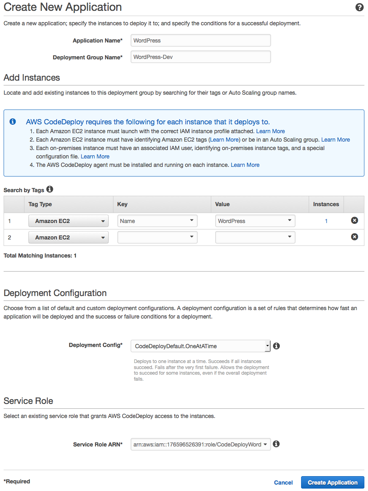</li></ol><ol class="c2 lst-kix_7wax3zl94t0p-0" start="4"><li class="c0 c10">You should end up on the &ldquo;wordpress&rdquo; application screen. Click the down arrow next to the &ldquo;develop&rdquo; deployment group and click the &ldquo;Deploy New Revision&rdquo; button. 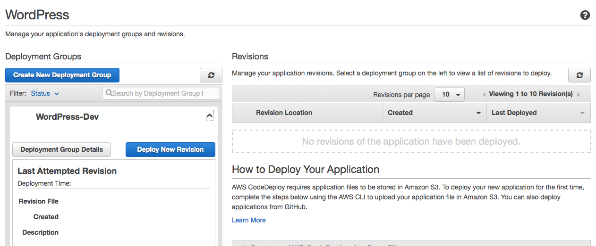</li><li class="c0 c10">On the &ldquo;Create New Deployment&rdquo; screen, next to &ldquo;Revision Type*&rdquo;, click the radio button next to &ldquo;My application is stored in GitHub&rdquo;. Then click &ldquo;Connect With GitHub&rdquo;. 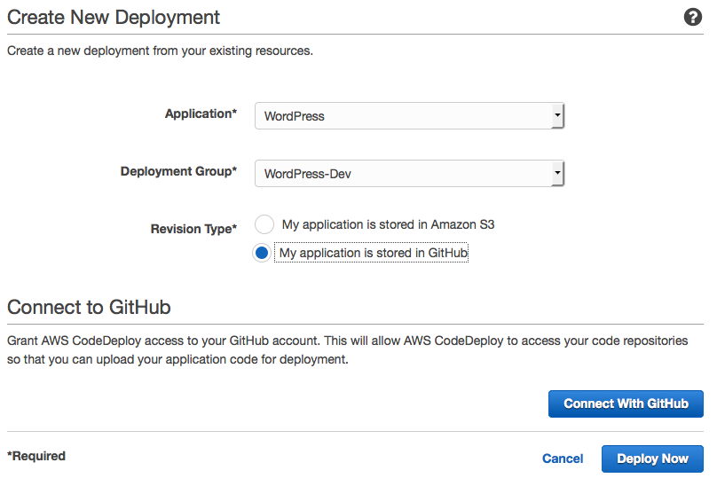</li><li class="c0 c10">Follow the instructions in the popup dialog to log into GitHub and provide the permissions.</li><li class="c0 c10">Fill out the fields:</li></ol><ol class="c2 lst-kix_7wax3zl94t0p-1 start" start="1"><li class="c0 c7">Application: wordpress</li><li class="c0 c7">Deployment Group: develop</li><li class="c0 c7">Repository Name: clientname/clientname-wp</li><li class="c0 c7">Commit ID: 99880f0ae690e38a082120f16bc290c2a58f30ab</li><li class="c0 c7">Deployment Config: CodeDeployDefault.OneAtATime</li></ol><ol class="c2 lst-kix_7wax3zl94t0p-0" start="8"><li class="c0 c10">Click &ldquo;Deploy Now&rdquo;. 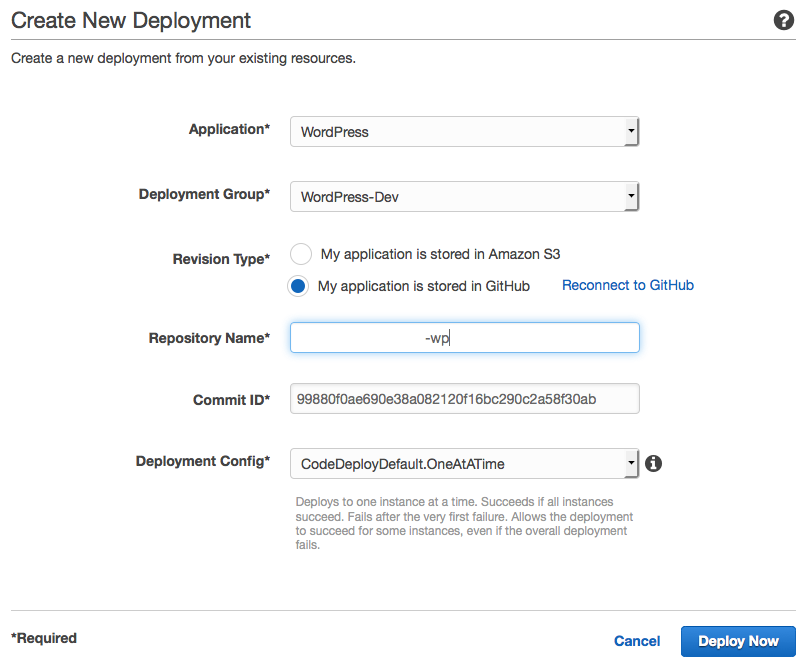</li><li class="c0 c10">If lucky, observe success message. 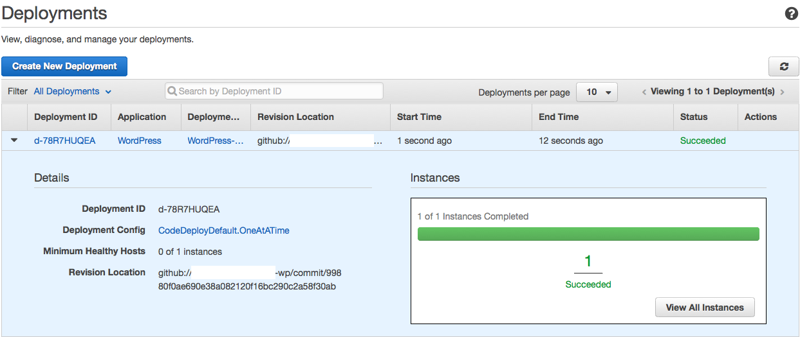</li></ol>

<h2 class="c0 c9">Calling AWS CodeDeploy from GitHub</h2><ol class="c2 lst-kix_z6zyrq3gfvo0-0 start" start="1"><li class="c0 c10">Click Apply Policy. Now you&rsquo;re ready to configure the AWS CodeDeploy service hook on GitHub. From the home page for your GitHub repository, click on the Settings&nbsp;tab. 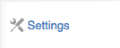</li><li class="c0 c10">On the Settings&nbsp;page, click the Webhooks &amp; Services&nbsp;tab. Then in the Services&nbsp;section, click the Add Service&nbsp;drop-down, and select AWS CodeDeploy. On the service hook page, enter the information needed to call CodeDeploy:</li></ol><ol class="c2 lst-kix_z6zyrq3gfvo0-1 start" start="1"><li class="c0 c7">Application name: wordpress</li><li class="c0 c7">Deployment group: develop</li><li class="c0 c7">Aws access key: from above</li><li class="c0 c7">AWS region: us-west-2</li><li class="c0 c7">GitHub api url: leave blank</li><li class="c0 c7">Aws secret access key: from above</li><li class="c0 c7">GitHub token: leave blank</li><li class="c0 c7">Active: check box</li></ol><ol class="c2 lst-kix_z6zyrq3gfvo0-0" start="3"><li class="c0 c10">Click &ldquo;Add service&rdquo;. 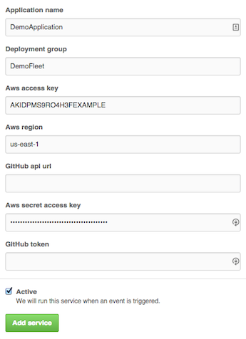</li></ol>

<h2 class="c0 c9">Automatically Starting Deployments from GitHub</h2><ol class="c2 lst-kix_r09a4d5dmmox-0 start" start="1"><li class="c0 c10">You first need to create a GitHub personal access token for the Auto-Deployment service to trigger a repository deployment. Go to the<a class="c4" href="https://www.google.com/url?q=https://github.com/settings/applications&amp;sa=D&amp;usg=AFQjCNFAiizg4XYqbr7h-dwKpJltDJidrw">&nbsp;</a><a class="c4" href="https://www.google.com/url?q=https://github.com/settings/applications&amp;sa=D&amp;usg=AFQjCNFAiizg4XYqbr7h-dwKpJltDJidrw">Applications</a>&nbsp;tab in the Personal Settings&nbsp;page for your GitHub account. In the Personal Access Tokens&nbsp;section, click Generate New Token. Enter &ldquo;AutoDeploy&rdquo; for the Token Description, uncheck all of the scope boxes, and check only the repo_deployment&nbsp;scope. 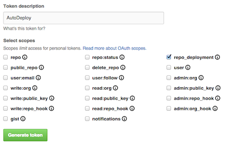</li><li class="c0 c10">Click Generate token. On the next page, copy the newly generated personal access token from the list, and store it in a safe place with the AWS access keys from before. You won&rsquo;t be able to access this token again.</li><li class="c0 c10">Now you need to configure the GitHub Auto-Deployment service hook on GitHub. From the home page for your GitHub repository, click on the Settings&nbsp;tab. On the Settings&nbsp;page, click the Webhooks &amp; Services&nbsp;tab. Then in the Services&nbsp;section, click the Add Service&nbsp;drop-down, and select GitHub Auto-Deployment. On the service hook page, enter the information needed to call GitHub, including the personal access token and target deployment group for CodeDeploy. &nbsp;&nbsp;&nbsp;&nbsp;&nbsp;&nbsp;&nbsp;&nbsp;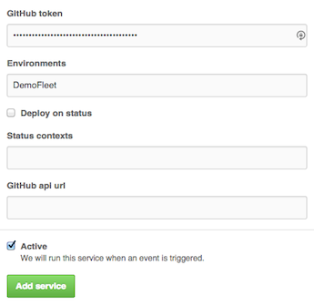</li><li class="c0 c10">After entering this information, click Add Service.</li><li class="c0 c10">Note there is no way to configure the branch used. The default branch is always used.</li></ol>

Allow EC2 instance to access EC2 AWS CLI commands

Added this to existing IAM Role CodeDeployEC2 InstanceRole:

&nbsp; &nbsp; &nbsp;&nbsp;&nbsp;&nbsp;&nbsp;&nbsp;&nbsp;&nbsp;&quot;ec2:DescribeVolumes&quot;,

&nbsp; &nbsp; &nbsp;&nbsp;&nbsp;&nbsp;&nbsp;&nbsp;&nbsp;&nbsp;&quot;ec2:CreateSnapshot&quot;,

&nbsp; &nbsp; &nbsp;&nbsp;&nbsp;&nbsp;&nbsp;&nbsp;&nbsp;&nbsp;&quot;ec2:DescribeSnapshots&quot;,

&nbsp; &nbsp; &nbsp;&nbsp;&nbsp;&nbsp;&nbsp;&nbsp;&nbsp;&nbsp;&quot;ec2:DeleteSnapshot&quot;,

&nbsp; &nbsp; &nbsp;&nbsp;&nbsp;&nbsp;&nbsp;&nbsp;&nbsp;&nbsp;&quot;ec2:CreateTags&quot;,

&nbsp; &nbsp; &nbsp;&nbsp;&nbsp;&nbsp;&nbsp;&nbsp;&nbsp;&nbsp;&quot;ec2:DescribeTags&quot;

<h1 class="c0 c9">CodeDeploy Example Setup</h1>

Instance settings
<ul class="c2 lst-kix_w6yxn841fr7-0 start"><li class="c0 c10">OS: Amazon Linux</li><li class="c0 c10">Type: t1.micro</li><li class="c0 c10">Key Pair Name: charlie</li><li class="c0 c10">Tag Key and Value: Name=CodeDeployDemo</li></ul>
CloudFormation actions
<ul class="c2 lst-kix_mzc71x2hapyz-0 start"><li class="c0 c10">IAM Role (<a class="c4" href="https://www.google.com/url?q=https://us-west-2.console.aws.amazon.com/iam/home?region%3Dus-west-2%23roles/CodeDeploySampleStack-4rocm-InstanceRole-EX75ZRUG8DX9&amp;sa=D&amp;usg=AFQjCNEBEzmBVcgQCTkqwqkAKJriH_9F5w">CodeDeploySampleStack-4rocm-InstanceRole-EX75ZRUG8DX9</a>)</li><li class="c0 c10">EC2 Security Group</li><li class="c0 c10">IAM Policy</li><li class="c0 c10">IAM Instance Profile</li><li class="c0 c10">EC2 Instance</li></ul>
CodeDeploy
<ul class="c2 lst-kix_h1a2jat8fype-0 start"><li class="c0 c10">Application Name: DemoApplication</li><li class="c0 c10">Revision</li></ul><ul class="c2 lst-kix_h1a2jat8fype-1 start"><li class="c0 c7">Revision Type</li></ul><ul class="c2 lst-kix_h1a2jat8fype-2 start"><li class="c0 c17">Sample Amazon Linux Application</li></ul><ul class="c2 lst-kix_h1a2jat8fype-1"><li class="c0 c7">Revision Location</li></ul><ul class="c2 lst-kix_h1a2jat8fype-2 start"><li class="c0 c17">https://s3-us-west-2.amazonaws.com/aws-codedeploy-us-west-2/samples/latest/SampleApp_Linux.zip</li></ul><ul class="c2 lst-kix_h1a2jat8fype-1"><li class="c0 c7">Revision Description</li></ul><ul class="c2 lst-kix_h1a2jat8fype-2 start"><li class="c0 c17">Sample web page for Amazon Linux. To view the sample web page after deployment, from your web browser go to http://&lt;Public DNS&gt;, for example <a class="c4" href="https://www.google.com/url?q=http://ec2-12-345-678-901.compute-1.amazonaws.com&amp;sa=D&amp;usg=AFQjCNEWGrPQfme5ljR3LwyVt90oGLAbIQ">http://ec2-12-345-678-901.compute-1.amazonaws.com</a>.</li></ul><ul class="c2 lst-kix_h1a2jat8fype-0"><li class="c0 c10">Deployment Group</li></ul><ul class="c2 lst-kix_h1a2jat8fype-1 start"><li class="c0 c7">Name: DemoFleet</li><li class="c0 c7">Instances: Name=CodeDeployDemo</li></ul><ul class="c2 lst-kix_h1a2jat8fype-0"><li class="c0 c10">Service Role</li></ul><ul class="c2 lst-kix_h1a2jat8fype-1 start"><li class="c0 c7">Select an existing service role that allows AWS CodeDeploy to work with other dependent AWS services on your behalf during a deployment.</li><li class="c0 c7">Create&nbsp;new,&nbsp;role name:&nbsp;CodeDeploy_DemoApplication {  &nbsp; &nbsp;&quot;Version&quot;:&nbsp;&quot;2008-10-17&quot;,  &nbsp; &nbsp;&quot;Statement&quot;:&nbsp;[  &nbsp; &nbsp; &nbsp; &nbsp;{  &nbsp; &nbsp; &nbsp; &nbsp; &nbsp; &nbsp;&quot;Effect&quot;:&nbsp;&quot;Allow&quot;,  &nbsp; &nbsp; &nbsp; &nbsp; &nbsp; &nbsp;&quot;Resource&quot;:&nbsp;[  &nbsp; &nbsp; &nbsp; &nbsp; &nbsp; &nbsp; &nbsp; &nbsp;&quot;*&quot;  &nbsp; &nbsp; &nbsp; &nbsp; &nbsp; &nbsp;],  &nbsp; &nbsp; &nbsp; &nbsp; &nbsp; &nbsp;&quot;Action&quot;:&nbsp;[  &nbsp; &nbsp; &nbsp; &nbsp; &nbsp; &nbsp; &nbsp; &nbsp;&quot;ec2:Describe*&quot;  &nbsp; &nbsp; &nbsp; &nbsp; &nbsp; &nbsp;]  &nbsp; &nbsp; &nbsp; &nbsp;},  &nbsp; &nbsp; &nbsp; &nbsp;{  &nbsp; &nbsp; &nbsp; &nbsp; &nbsp; &nbsp;&quot;Effect&quot;:&nbsp;&quot;Allow&quot;,  &nbsp; &nbsp; &nbsp; &nbsp; &nbsp; &nbsp;&quot;Resource&quot;:&nbsp;[  &nbsp; &nbsp; &nbsp; &nbsp; &nbsp; &nbsp; &nbsp; &nbsp;&quot;*&quot;  &nbsp; &nbsp; &nbsp; &nbsp; &nbsp; &nbsp;],  &nbsp; &nbsp; &nbsp; &nbsp; &nbsp; &nbsp;&quot;Action&quot;:&nbsp;[  &nbsp; &nbsp; &nbsp; &nbsp; &nbsp; &nbsp; &nbsp; &nbsp;&quot;autoscaling:CompleteLifecycleAction&quot;,  &nbsp; &nbsp; &nbsp; &nbsp; &nbsp; &nbsp; &nbsp; &nbsp;&quot;autoscaling:DeleteLifecycleHook&quot;,  &nbsp; &nbsp; &nbsp; &nbsp; &nbsp; &nbsp; &nbsp; &nbsp;&quot;autoscaling:DescribeLifecycleHooks&quot;,  &nbsp; &nbsp; &nbsp; &nbsp; &nbsp; &nbsp; &nbsp; &nbsp;&quot;autoscaling:DescribeAutoScalingGroups&quot;,  &nbsp; &nbsp; &nbsp; &nbsp; &nbsp; &nbsp; &nbsp; &nbsp;&quot;autoscaling:PutLifecycleHook&quot;,  &nbsp; &nbsp; &nbsp; &nbsp; &nbsp; &nbsp; &nbsp; &nbsp;&quot;autoscaling:RecordLifecycleActionHeartbeat&quot;  &nbsp; &nbsp; &nbsp; &nbsp; &nbsp; &nbsp;]  &nbsp; &nbsp; &nbsp; &nbsp;},  &nbsp; &nbsp; &nbsp; &nbsp;{  &nbsp; &nbsp; &nbsp; &nbsp; &nbsp; &nbsp;&quot;Effect&quot;:&nbsp;&quot;Allow&quot;,  &nbsp; &nbsp; &nbsp; &nbsp; &nbsp; &nbsp;&quot;Resource&quot;:&nbsp;[  &nbsp; &nbsp; &nbsp; &nbsp; &nbsp; &nbsp; &nbsp; &nbsp;&quot;*&quot;  &nbsp; &nbsp; &nbsp; &nbsp; &nbsp; &nbsp;],  &nbsp; &nbsp; &nbsp; &nbsp; &nbsp; &nbsp;&quot;Action&quot;:&nbsp;[  &nbsp; &nbsp; &nbsp; &nbsp; &nbsp; &nbsp; &nbsp; &nbsp;&quot;Tag:getResources&quot;,  &nbsp; &nbsp; &nbsp; &nbsp; &nbsp; &nbsp; &nbsp; &nbsp;&quot;Tag:getTags&quot;,  &nbsp; &nbsp; &nbsp; &nbsp; &nbsp; &nbsp; &nbsp; &nbsp;&quot;Tag:getTagsForResource&quot;,  &nbsp; &nbsp; &nbsp; &nbsp; &nbsp; &nbsp; &nbsp; &nbsp;&quot;Tag:getTagsForResourceList&quot;  &nbsp; &nbsp; &nbsp; &nbsp; &nbsp; &nbsp;]  &nbsp; &nbsp; &nbsp; &nbsp;}  &nbsp; &nbsp;] }</li></ul><ul class="c2 lst-kix_h1a2jat8fype-0"><li class="c0 c10">Deployment Configuration</li></ul><ul class="c2 lst-kix_h1a2jat8fype-1 start"><li class="c0 c7">Default One at a Time</li></ul>

<h2 class="c0 c9">Resulting Configuration</h2>

Resulting EC2 servers did not have a ~/.aws directory, so there was also no config file inside. This leads me to think the setup is not dependent on a specific AWS user&rsquo;s key and secret, unless there is something special about the example setup. 

<h3 class="c0 c9">IAM Roles</h3>

<a class="c4" href="https://www.google.com/url?q=https://us-west-2.console.aws.amazon.com/iam/home?region%3Dus-west-2%23roles/CodeDeploySampleStack-4rocm-InstanceRole-EX75ZRUG8DX9&amp;sa=D&amp;usg=AFQjCNEBEzmBVcgQCTkqwqkAKJriH_9F5w">CodeDeploySampleStack-4rocm-InstanceRole-EX75ZRUG8DX9</a>

Permissions: Inline Policies

Policy Name: InstanceRole

{

&nbsp;&nbsp;&nbsp;&nbsp;&nbsp;&nbsp;&nbsp;&nbsp;&quot;Statement&quot;:&nbsp;[

&nbsp; &nbsp; &nbsp;&nbsp;&nbsp;&nbsp;&nbsp;&nbsp;&nbsp;&nbsp;{

&nbsp; &nbsp; &nbsp; &nbsp; &nbsp;&nbsp;&nbsp;&nbsp;&nbsp;&nbsp;&nbsp;&nbsp;&quot;Resource&quot;:&nbsp;&quot;*&quot;,

&nbsp; &nbsp; &nbsp; &nbsp; &nbsp;&nbsp;&nbsp;&nbsp;&nbsp;&nbsp;&nbsp;&nbsp;&quot;Action&quot;:&nbsp;[

&nbsp; &nbsp; &nbsp; &nbsp; &nbsp; &nbsp; &nbsp;&nbsp;&nbsp;&nbsp;&nbsp;&nbsp;&nbsp;&nbsp;&quot;autoscaling:Describe*&quot;,

&nbsp; &nbsp; &nbsp; &nbsp; &nbsp; &nbsp; &nbsp;&nbsp;&nbsp;&nbsp;&nbsp;&nbsp;&nbsp;&nbsp;&quot;cloudformation:Describe*&quot;,

&nbsp; &nbsp; &nbsp; &nbsp; &nbsp; &nbsp; &nbsp;&nbsp;&nbsp;&nbsp;&nbsp;&nbsp;&nbsp;&nbsp;&quot;cloudformation:GetTemplate&quot;,

&nbsp; &nbsp; &nbsp; &nbsp; &nbsp; &nbsp; &nbsp;&nbsp;&nbsp;&nbsp;&nbsp;&nbsp;&nbsp;&nbsp;&quot;s3:Get*&quot;

&nbsp; &nbsp; &nbsp; &nbsp; &nbsp;&nbsp;&nbsp;&nbsp;&nbsp;&nbsp;&nbsp;&nbsp;],

&nbsp; &nbsp; &nbsp; &nbsp; &nbsp;&nbsp;&nbsp;&nbsp;&nbsp;&nbsp;&nbsp;&nbsp;&quot;Effect&quot;:&nbsp;&quot;Allow&quot;

&nbsp; &nbsp; &nbsp;&nbsp;&nbsp;&nbsp;&nbsp;&nbsp;&nbsp;&nbsp;}

&nbsp;&nbsp;&nbsp;&nbsp;&nbsp;&nbsp;&nbsp;&nbsp;]

}

Trust Relationships

{

&nbsp; &quot;Version&quot;:&nbsp;&quot;2008-10-17&quot;,

&nbsp; &quot;Statement&quot;:&nbsp;[

&nbsp;&nbsp;&nbsp;&nbsp;&nbsp;&nbsp;&nbsp;&nbsp;{

&nbsp; &nbsp;&nbsp;&nbsp;&nbsp;&nbsp;&nbsp;&nbsp;&nbsp;&quot;Sid&quot;:&nbsp;&quot;&quot;,

&nbsp; &nbsp;&nbsp;&nbsp;&nbsp;&nbsp;&nbsp;&nbsp;&nbsp;&quot;Effect&quot;:&nbsp;&quot;Allow&quot;,

&nbsp; &nbsp;&nbsp;&nbsp;&nbsp;&nbsp;&nbsp;&nbsp;&nbsp;&quot;Principal&quot;:&nbsp;{

&nbsp; &nbsp; &nbsp;&nbsp;&nbsp;&nbsp;&nbsp;&nbsp;&nbsp;&nbsp;&quot;Service&quot;:&nbsp;&quot;ec2.amazonaws.com&quot;

&nbsp; &nbsp;&nbsp;&nbsp;&nbsp;&nbsp;&nbsp;&nbsp;&nbsp;},

&nbsp; &nbsp;&nbsp;&nbsp;&nbsp;&nbsp;&nbsp;&nbsp;&nbsp;&quot;Action&quot;:&nbsp;&quot;sts:AssumeRole&quot;

&nbsp;&nbsp;&nbsp;&nbsp;&nbsp;&nbsp;&nbsp;&nbsp;}

&nbsp; ]

}

CodeDeploy_DemoApplication

Permissions: Inline Policies

Policy Name: CodeDeployPolicy

{

&nbsp;&nbsp;&nbsp;&nbsp;&nbsp;&nbsp;&nbsp;&nbsp;&quot;Version&quot;:&nbsp;&quot;2008-10-17&quot;,

&nbsp;&nbsp;&nbsp;&nbsp;&nbsp;&nbsp;&nbsp;&nbsp;&quot;Statement&quot;:&nbsp;[

&nbsp; &nbsp; &nbsp;&nbsp;&nbsp;&nbsp;&nbsp;&nbsp;&nbsp;&nbsp;{

&nbsp; &nbsp; &nbsp; &nbsp; &nbsp;&nbsp;&nbsp;&nbsp;&nbsp;&nbsp;&nbsp;&nbsp;&quot;Effect&quot;:&nbsp;&quot;Allow&quot;,

&nbsp; &nbsp; &nbsp; &nbsp; &nbsp;&nbsp;&nbsp;&nbsp;&nbsp;&nbsp;&nbsp;&nbsp;&quot;Resource&quot;:&nbsp;[

&nbsp; &nbsp; &nbsp; &nbsp; &nbsp; &nbsp; &nbsp;&nbsp;&nbsp;&nbsp;&nbsp;&nbsp;&nbsp;&nbsp;&quot;*&quot;

&nbsp; &nbsp; &nbsp; &nbsp; &nbsp;&nbsp;&nbsp;&nbsp;&nbsp;&nbsp;&nbsp;&nbsp;],

&nbsp; &nbsp; &nbsp; &nbsp; &nbsp;&nbsp;&nbsp;&nbsp;&nbsp;&nbsp;&nbsp;&nbsp;&quot;Action&quot;:&nbsp;[

&nbsp; &nbsp; &nbsp; &nbsp; &nbsp; &nbsp; &nbsp;&nbsp;&nbsp;&nbsp;&nbsp;&nbsp;&nbsp;&nbsp;&quot;ec2:Describe*&quot;

&nbsp; &nbsp; &nbsp; &nbsp; &nbsp;&nbsp;&nbsp;&nbsp;&nbsp;&nbsp;&nbsp;&nbsp;]

&nbsp; &nbsp; &nbsp;&nbsp;&nbsp;&nbsp;&nbsp;&nbsp;&nbsp;&nbsp;},

&nbsp; &nbsp; &nbsp;&nbsp;&nbsp;&nbsp;&nbsp;&nbsp;&nbsp;&nbsp;{

&nbsp; &nbsp; &nbsp; &nbsp; &nbsp;&nbsp;&nbsp;&nbsp;&nbsp;&nbsp;&nbsp;&nbsp;&quot;Effect&quot;:&nbsp;&quot;Allow&quot;,

&nbsp; &nbsp; &nbsp; &nbsp; &nbsp;&nbsp;&nbsp;&nbsp;&nbsp;&nbsp;&nbsp;&nbsp;&quot;Resource&quot;:&nbsp;[

&nbsp; &nbsp; &nbsp; &nbsp; &nbsp; &nbsp; &nbsp;&nbsp;&nbsp;&nbsp;&nbsp;&nbsp;&nbsp;&nbsp;&quot;*&quot;

&nbsp; &nbsp; &nbsp; &nbsp; &nbsp;&nbsp;&nbsp;&nbsp;&nbsp;&nbsp;&nbsp;&nbsp;],

&nbsp; &nbsp; &nbsp; &nbsp; &nbsp;&nbsp;&nbsp;&nbsp;&nbsp;&nbsp;&nbsp;&nbsp;&quot;Action&quot;:&nbsp;[

&nbsp; &nbsp; &nbsp; &nbsp; &nbsp; &nbsp; &nbsp;&nbsp;&nbsp;&nbsp;&nbsp;&nbsp;&nbsp;&nbsp;&quot;autoscaling:CompleteLifecycleAction&quot;,

&nbsp; &nbsp; &nbsp; &nbsp; &nbsp; &nbsp; &nbsp;&nbsp;&nbsp;&nbsp;&nbsp;&nbsp;&nbsp;&nbsp;&quot;autoscaling:DeleteLifecycleHook&quot;,

&nbsp; &nbsp; &nbsp; &nbsp; &nbsp; &nbsp; &nbsp;&nbsp;&nbsp;&nbsp;&nbsp;&nbsp;&nbsp;&nbsp;&quot;autoscaling:DescribeLifecycleHooks&quot;,

&nbsp; &nbsp; &nbsp; &nbsp; &nbsp; &nbsp; &nbsp;&nbsp;&nbsp;&nbsp;&nbsp;&nbsp;&nbsp;&nbsp;&quot;autoscaling:DescribeAutoScalingGroups&quot;,

&nbsp; &nbsp; &nbsp; &nbsp; &nbsp; &nbsp; &nbsp;&nbsp;&nbsp;&nbsp;&nbsp;&nbsp;&nbsp;&nbsp;&quot;autoscaling:PutLifecycleHook&quot;,

&nbsp; &nbsp; &nbsp; &nbsp; &nbsp; &nbsp; &nbsp;&nbsp;&nbsp;&nbsp;&nbsp;&nbsp;&nbsp;&nbsp;&quot;autoscaling:RecordLifecycleActionHeartbeat&quot;

&nbsp; &nbsp; &nbsp; &nbsp; &nbsp;&nbsp;&nbsp;&nbsp;&nbsp;&nbsp;&nbsp;&nbsp;]

&nbsp; &nbsp; &nbsp;&nbsp;&nbsp;&nbsp;&nbsp;&nbsp;&nbsp;&nbsp;},

&nbsp; &nbsp; &nbsp;&nbsp;&nbsp;&nbsp;&nbsp;&nbsp;&nbsp;&nbsp;{

&nbsp; &nbsp; &nbsp; &nbsp; &nbsp;&nbsp;&nbsp;&nbsp;&nbsp;&nbsp;&nbsp;&nbsp;&quot;Effect&quot;:&nbsp;&quot;Allow&quot;,

&nbsp; &nbsp; &nbsp; &nbsp; &nbsp;&nbsp;&nbsp;&nbsp;&nbsp;&nbsp;&nbsp;&nbsp;&quot;Resource&quot;:&nbsp;[

&nbsp; &nbsp; &nbsp; &nbsp; &nbsp; &nbsp; &nbsp;&nbsp;&nbsp;&nbsp;&nbsp;&nbsp;&nbsp;&nbsp;&quot;*&quot;

&nbsp; &nbsp; &nbsp; &nbsp; &nbsp;&nbsp;&nbsp;&nbsp;&nbsp;&nbsp;&nbsp;&nbsp;],

&nbsp; &nbsp; &nbsp; &nbsp; &nbsp;&nbsp;&nbsp;&nbsp;&nbsp;&nbsp;&nbsp;&nbsp;&quot;Action&quot;:&nbsp;[

&nbsp; &nbsp; &nbsp; &nbsp; &nbsp; &nbsp; &nbsp;&nbsp;&nbsp;&nbsp;&nbsp;&nbsp;&nbsp;&nbsp;&quot;Tag:getResources&quot;,

&nbsp; &nbsp; &nbsp; &nbsp; &nbsp; &nbsp; &nbsp;&nbsp;&nbsp;&nbsp;&nbsp;&nbsp;&nbsp;&nbsp;&quot;Tag:getTags&quot;,

&nbsp; &nbsp; &nbsp; &nbsp; &nbsp; &nbsp; &nbsp;&nbsp;&nbsp;&nbsp;&nbsp;&nbsp;&nbsp;&nbsp;&quot;Tag:getTagsForResource&quot;,

&nbsp; &nbsp; &nbsp; &nbsp; &nbsp; &nbsp; &nbsp;&nbsp;&nbsp;&nbsp;&nbsp;&nbsp;&nbsp;&nbsp;&quot;Tag:getTagsForResourceList&quot;

&nbsp; &nbsp; &nbsp; &nbsp; &nbsp;&nbsp;&nbsp;&nbsp;&nbsp;&nbsp;&nbsp;&nbsp;]

&nbsp; &nbsp; &nbsp;&nbsp;&nbsp;&nbsp;&nbsp;&nbsp;&nbsp;&nbsp;}

&nbsp;&nbsp;&nbsp;&nbsp;&nbsp;&nbsp;&nbsp;&nbsp;]

}

Trust Relationships

{

&nbsp; &quot;Version&quot;:&nbsp;&quot;2008-10-17&quot;,

&nbsp; &quot;Statement&quot;:&nbsp;[

&nbsp;&nbsp;&nbsp;&nbsp;&nbsp;&nbsp;&nbsp;&nbsp;{

&nbsp; &nbsp;&nbsp;&nbsp;&nbsp;&nbsp;&nbsp;&nbsp;&nbsp;&quot;Sid&quot;:&nbsp;&quot;1&quot;,

&nbsp; &nbsp;&nbsp;&nbsp;&nbsp;&nbsp;&nbsp;&nbsp;&nbsp;&quot;Effect&quot;:&nbsp;&quot;Allow&quot;,

&nbsp; &nbsp;&nbsp;&nbsp;&nbsp;&nbsp;&nbsp;&nbsp;&nbsp;&quot;Principal&quot;:&nbsp;{

&nbsp; &nbsp; &nbsp;&nbsp;&nbsp;&nbsp;&nbsp;&nbsp;&nbsp;&nbsp;&quot;Service&quot;:&nbsp;&quot;codedeploy.amazonaws.com&quot;

&nbsp; &nbsp;&nbsp;&nbsp;&nbsp;&nbsp;&nbsp;&nbsp;&nbsp;},

&nbsp; &nbsp;&nbsp;&nbsp;&nbsp;&nbsp;&nbsp;&nbsp;&nbsp;&quot;Action&quot;:&nbsp;&quot;sts:AssumeRole&quot;

&nbsp;&nbsp;&nbsp;&nbsp;&nbsp;&nbsp;&nbsp;&nbsp;}

&nbsp; ]

}
<h3 class="c0 c9">IAM Policies</h3>

None seem to be selected and attached. Only two policies are attached and they are the same as before, and none of the ones with &ldquo;CodeDeploy&rdquo; in the name are attached.

<h3 class="c0 c9">EC2 Security Groups</h3>

CodeDeploySampleStack-4rocm-SecurityGroup-KFZPG1TCMMSS

Just allows ports 22 and 80 in, all out.

Tags
<ul class="c2 lst-kix_ohs0o3zi12ai-0 start"><li class="c0 c10">aws:cloudformation:logical-id=SecurityGroup</li><li class="c0 c10">aws:cloudformation:stack-id=arn:aws:cloudformation:us-west-2:176596526391:stack/CodeDeploySampleStack-4rocm/9b6d2710-3c6a-11e5-b1ed-500160d4da7c</li><li class="c0 c10">aws:cloudformation:stack-name=CodeDeploySampleStack-4rocm</li></ul>
