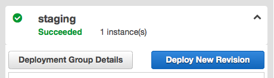

# Deploy a specific commit to a server or group

Go to the “wordpress” application page by navigating to:

AWS Services > CodeDeploy > N. Virginia > [Applications](https://console.aws.amazon.com/codedeploy/home?region=us-east-1#/applications) > [wordpress](https://console.aws.amazon.com/codedeploy/home?region=us-east-1#/applications/wordpress)

You’ll see the configured deployment groups at the left, and a list of recent deployments at the right. 

Clicking any deployment under “Revisions” will show if it was successfully deployed to any servers under the “Deployment Groups Deployed To” header.

To manually trigger a deployment, click one of the groups under “Deployment Groups,” such as “staging”, and then click “Deploy New Revision”.

* **Application:** Should already be set to “wordpress”
* **Deployment Group:** Should already be set if you got to this page following these steps. Otherwise make sure this is set appropriately, as this determines which servers will be deployed to:
  * **develop**: `dev.domain.com`
  * **staging**: `stage.domain.com`
  * **prod**: all app servers behind load balancer for `www.domain.com`
  * **test**: `test.domain.com`, used in testing migrations
* **Revision Type:** Select “My application is stored in GitHub”. This may require authentication with GitHub. If that is the case, you should log in with the account `clientnamedeploy` (password: `PASSWORD`).
* **Repository Name:** `clientname/clientname-wp`
* **Commit ID:** Paste the hash for the commit you want to deploy.
* **Deployment Config:** Leave on “CodeDeployDefault.OneAtATime”
* Click “Deploy Now”.

The next screen shows the status of the deployment. It should automatically refresh, and the deployment should be finished in a few minutes.
